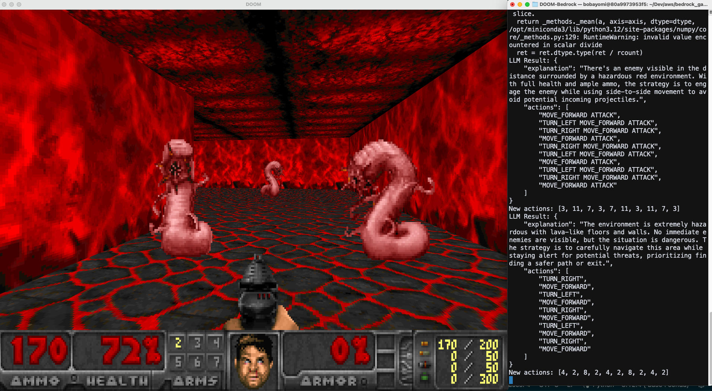

# DOOM-Bedrock

Experience DOOM powered by Amazon Bedrock.



## Introduction
DOOM-Bedrock leverages [VizDoom](https://github.com/Farama-Foundation/ViZDoom) and the [LevDoom](https://github.com/TTomilin/LevDoom) benchmark, which offers various difficulty levels based on visual modifications. While LevDoom was originally designed for research in deep reinforcement learning generalization, our project takes a different approach. We harness the power of Amazon Bedrock to process screen data using multimodal Large Language Models (LLMs), determining the next actions in gameplay.

Our focus is on the `Seek and Slay` module, where the AI agent navigates the map to locate and engage enemies. This unique combination of classic gaming and cutting-edge AI showcases the potential of LLMs in complex, visual decision-making tasks.

## Requirements
- python3.9+

## Installation
To set up DOOM-Bedrock, follow these steps:

```sh
git clone https://github.com/aws-banjo/DOOM-Bedrock
cd DOOM-Bedrock
pip install -r requirements.txt
git clone https://github.com/TTomilin/LevDoom
cd LevDoom
pip install -e .
cd ..
``` 

### Configuring Amazon Bedrock API

To get started with Amazon Bedrock:

1. Enable the required models in your [Amazon Bedrock console](https://us-east-1.console.aws.amazon.com/bedrock/home?region=us-east-1#/modelaccess) :
2. We are using Claude 3.5 Sonnet for this project. For detailed information on available models, consult the [Amazon Bedrock User Guide]((https://docs.aws.amazon.com/bedrock/latest/userguide/model-access.html)).
3. Update the region in the code (line 13 of the main script) to match your AWS region:

```python
# Setup bedrock
bedrock_runtime = boto3.client(
    service_name="bedrock-runtime",
    region_name="us-west-2", # Replace with your region
)
```

## Let's Play Doom

To Start you can run

```bash
python doom_berdock.py
```


### Change environment

LevDoom offers various environments to play in. You can modify the environment by changing the code on line 170:

```python
    env = levdoom.make(
        "SeekAndSlayLevel1_2-v0"
    )  # Can replace witgh other LevDoom Levels
```

Available environments:

| Level | Environment            | Map                          |
|-------|------------------------|------------------------------|
| 0     | SeekAndSlayLevel0-v0   | default                      |
|       |                        |
| 1     | SeekAndSlayLevel1_1-v0 | blue                         |
|       | SeekAndSlayLevel1_2-v0 | red                          |
|       | SeekAndSlayLevel1_3-v0 | obstacles                    |
|       | SeekAndSlayLevel1_4-v0 | resized_enemies              |
|       | SeekAndSlayLevel1_5-v0 | shadows                      |
|       | SeekAndSlayLevel1_6-v0 | mixed_enemies                |
|       | SeekAndSlayLevel1_7-v0 | invulnerable                 |
|       |                        |
| 2     | SeekAndSlayLevel2_1-v0 | blue_shadows                 |
|       | SeekAndSlayLevel2_2-v0 | obstacles_resized_enemies    |
|       | SeekAndSlayLevel2_3-v0 | red_mixed_enemies            |
|       | SeekAndSlayLevel2_4-v0 | invulnerable_blue            |
|       | SeekAndSlayLevel2_5-v0 | resized_enemies_red          |
|       | SeekAndSlayLevel2_6-v0 | shadows_obstacles            |
|       |                        |
| 3     | SeekAndSlayLevel3_1-v0 | blue_mixed_resized_enemies   |
|       | SeekAndSlayLevel3_2-v0 | red_obstacles_invulnerable   |
|       | SeekAndSlayLevel3_3-v0 | resized_shadows_invulnerable |
|       |                        |
| 4     | SeekAndSlayLevel4-v0   | complete                     |

## Acknowledgement

This project is built upon the [LevDoom](https://github.com/TTomilin/LevDoom) environment. We extend our gratitude to its creators:

```bibtex
@inproceedings{tomilin2022levdoom,
  title     = {LevDoom: A Benchmark for Generalization on Level Difficulty in Reinforcement Learning},
  author    = {Tristan Tomilin and Tianhong Dai and Meng Fang and Mykola Pechenizkiy},
  booktitle = {In Proceedings of the IEEE Conference on Games},
  year      = {2022}
}
```